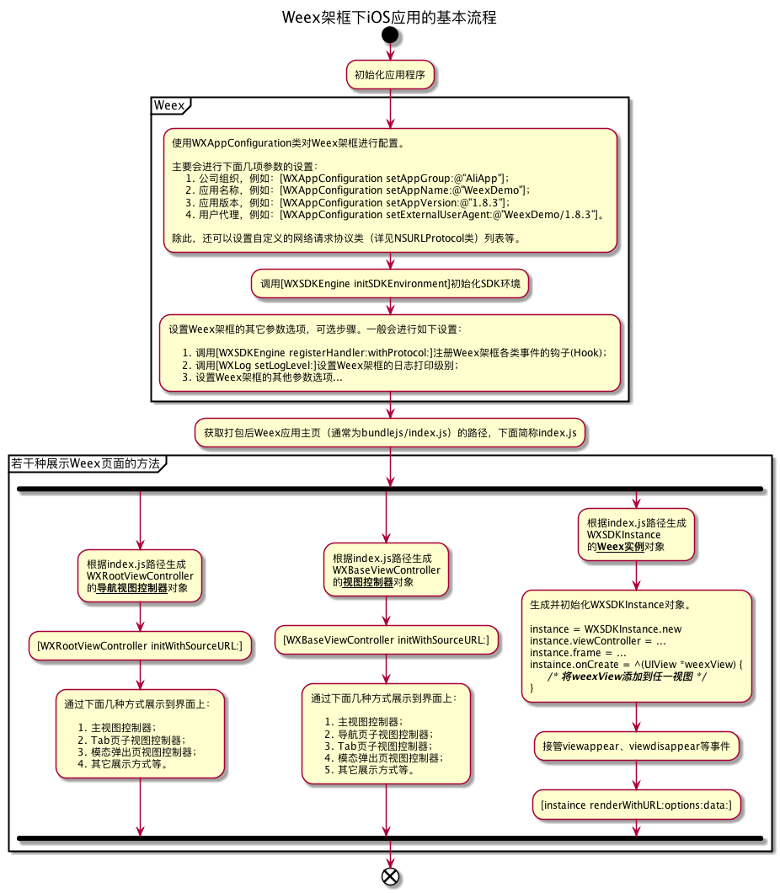
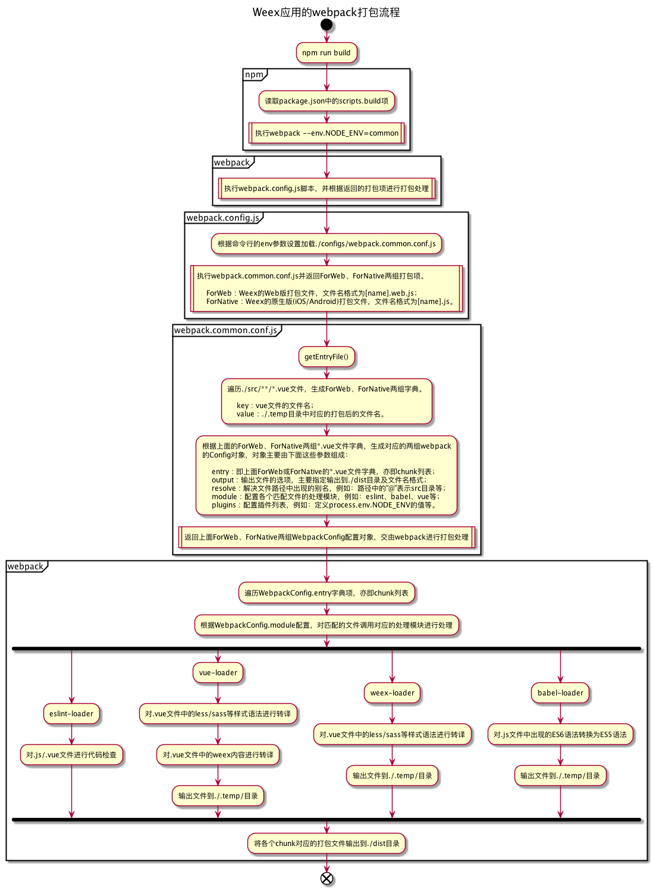

# weexdemo

该工程仅用于分析研究WeeX在前端应用的可行性。


## 1. 环境准备

- [Node.js](https://nodejs.org/en/download/) : 含npm等前端工具；
- [cnpm](http://npm.taobao.org/) : 淘宝npm替代工具，主要使用国内镜像加速npm包下载速度，安装命令： `npm install -g cnpm --registry=https://registry.npm.taobao.org` ；
- [weex-toolkit](https://weex.apache.org/zh/guide/introduction.html) : Weex的脚本架工具，安装命令： `npm install -g weex-toolkit@beta` （当前建议安装beta版，正式版与最新的包管理工具等不兼容）；
- [Xcode](https://developer.apple.com/xcode/) : 针对iOS应用，提供相关编译链工具；
- [CocoaPods](https://cocoapods.org/) : 针对iOS应用，与Xcode搭配使用，作为iOS应用的第三方包管理工具；
- [Android SDK](https://developer.android.com/) : 针对Android应用，提供相关编译链工具。建议安装 Android Stdio ，对 Android SDK 进行安装更新。


## 2. 运行weexdemo工程

1. 下载weexdemo源代码：

```
$ git clone https://github.com/keqiongpan/weexdemo.git
```

2. 初始化编译环境：

```
$ cd ./weexdemo
$ npm run inst
```

3. 运行各个平台weexdemo应用

```
$ weex run web
$ weex run ios
$ weex run android
```

对于详细的工程搭建细节，可以参考 [INSTALL.md](INSTALL.md) 文件，里面详细记录了环境细节及命令执行结果。


## 3. 工程结构

主要分成三部份：weex源代码（即web版源代码）、iOS版源代码、Android版源代码，以及编译产生的文件。

### 3.1 web版源代码

```
./weexdemo/.babelrc
./weexdemo/.eslintrc.js
./weexdemo/.eslintignore
./weexdemo/.postcssrc.js
./weexdemo/README.md
./weexdemo/package.json
./weexdemo/ios.config.json
./weexdemo/android.config.json
./weexdemo/webpack.config.js
./weexdemo/configs/hotreload.js
./weexdemo/configs/webpack.common.conf.js
./weexdemo/configs/config.js
./weexdemo/configs/webpack.release.conf.js
./weexdemo/configs/webpack.dev.conf.js
./weexdemo/configs/webpack.prod.conf.js
./weexdemo/configs/logo.png
./weexdemo/configs/utils.js
./weexdemo/configs/vue-loader.conf.js
./weexdemo/configs/plugin.js
./weexdemo/configs/webpack.test.conf.js
./weexdemo/configs/helper.js
./weexdemo/plugins/plugins.json
./weexdemo/platforms/platforms.json
./weexdemo/src/index.vue
./weexdemo/src/components/HelloWorld.vue
./weexdemo/src/entry.js
./weexdemo/web/preview.html
./weexdemo/web/index.html
./weexdemo/web/assets/qrcode.js
./weexdemo/web/assets/preview.css
./weexdemo/test/unit/specs/index.spec.js
./weexdemo/test/unit/.eslintrc
./weexdemo/test/unit/index.js
./weexdemo/test/unit/karma.conf.js
```

### 3.2 iOS版源代码：

```
./weexdemo/platforms/ios/README.md
./weexdemo/platforms/ios/LICENSE
./weexdemo/platforms/ios/weex.png
./weexdemo/platforms/ios/weex@2x.png
./weexdemo/platforms/ios/Podfile
./weexdemo/platforms/ios/WeexDemo.xcworkspace/contents.xcworkspacedata
./weexdemo/platforms/ios/WeexDemo.xcodeproj/project.pbxproj
./weexdemo/platforms/ios/WeexDemo/main.m
./weexdemo/platforms/ios/WeexDemo/config.xml
./weexdemo/platforms/ios/WeexDemo/DemoDefine.h
./weexdemo/platforms/ios/WeexDemo/AppDelegate.h
./weexdemo/platforms/ios/WeexDemo/AppDelegate.m
./weexdemo/platforms/ios/WeexDemo/WeexConfig/WeexSDKManager.h
./weexdemo/platforms/ios/WeexDemo/WeexConfig/WeexSDKManager.m
./weexdemo/platforms/ios/WeexDemo/WeexConfig/WXImgLoaderDefaultImpl.h
./weexdemo/platforms/ios/WeexDemo/WeexConfig/WXImgLoaderDefaultImpl.m
./weexdemo/platforms/ios/WeexDemo/WeexScanner/WXDemoViewController.h
./weexdemo/platforms/ios/WeexDemo/WeexScanner/WXDemoViewController.m
./weexdemo/platforms/ios/WeexDemo/WeexScanner/UIViewController+WXDemoNaviBar.m
./weexdemo/platforms/ios/WeexDemo/WeexScanner/UIViewController+WXDemoNaviBar.h
./weexdemo/platforms/ios/WeexDemo/weex-icon.png
./weexdemo/platforms/ios/WeexDemo/WeexDemo-Info.plist
./weexdemo/platforms/ios/WeexDemo/Assets.xcassets/...（此处省略）
./weexdemo/platforms/ios/WeexDemo/Images.xcassets/Brand Assets.launchimage/Contents.json
./weexdemo/platforms/ios/WeexUITestDemoUITests/WeexUITestDemoUITests.m
./weexdemo/platforms/ios/WeexUITestDemoUITests/Info.plist
./weexdemo/platforms/ios/WeexUITestDemo-Info.plist
./weexdemo/platforms/ios/WeexDemoTests/WeexDemoTests.m
./weexdemo/platforms/ios/WeexDemoTests/Info.plist
./weexdemo/platforms/ios/app/src/main/assets/dist/index.js
./weexdemo/platforms/ios/app/src/main/assets/dist/components/HelloWorld.js
./weexdemo/platforms/ios/bundlejs/index.js
./weexdemo/platforms/ios/bundlejs/components/HelloWorld.js
```

### 3.3 Android版源代码

```
./weexdemo/platforms/android/.gitignore
./weexdemo/platforms/android/.weex_plugin.json
./weexdemo/platforms/android/.project
./weexdemo/platforms/android/README.md
./weexdemo/platforms/android/LICENSE
./weexdemo/platforms/android/NOTICE
./weexdemo/platforms/android/codeStyleSettings.xml
./weexdemo/platforms/android/gradlew
./weexdemo/platforms/android/gradlew.bat
./weexdemo/platforms/android/build.gradle
./weexdemo/platforms/android/settings.gradle
./weexdemo/platforms/android/gradle.properties
./weexdemo/platforms/android/gradle/wrapper/gradle-wrapper.jar
./weexdemo/platforms/android/gradle/wrapper/gradle-wrapper.properties
./weexdemo/platforms/android/app/.gitignore
./weexdemo/platforms/android/app/.project
./weexdemo/platforms/android/app/build.gradle
./weexdemo/platforms/android/app/proguard-rules.pro
./weexdemo/platforms/android/app/tools/debug.keystore
./weexdemo/platforms/android/app/src/main/res/...（此处省略）
./weexdemo/platforms/android/app/src/main/AndroidManifest.xml
./weexdemo/platforms/android/app/src/main/java/com/weex/app/extend/BlurTool.java
./weexdemo/platforms/android/app/src/main/java/com/weex/app/extend/BlurTransformation.java
./weexdemo/platforms/android/app/src/main/java/com/weex/app/extend/ImageAdapter.java
./weexdemo/platforms/android/app/src/main/java/com/weex/app/extend/WXEventModule.java
./weexdemo/platforms/android/app/src/main/java/com/weex/app/util/AppConfigXmlParser.java
./weexdemo/platforms/android/app/src/main/java/com/weex/app/util/CommonUtils.java
./weexdemo/platforms/android/app/src/main/java/com/weex/app/util/AppPreferences.java
./weexdemo/platforms/android/app/src/main/java/com/weex/app/util/AppConfig.java
./weexdemo/platforms/android/app/src/main/java/com/weex/app/util/Constants.java
./weexdemo/platforms/android/app/src/main/java/com/weex/app/WXPageActivity.java
./weexdemo/platforms/android/app/src/main/java/com/weex/app/SplashActivity.java
./weexdemo/platforms/android/app/src/main/java/com/weex/app/WXApplication.java
./weexdemo/platforms/android/app/src/main/java/com/weex/app/AbsWeexActivity.java
./weexdemo/platforms/android/app/src/main/java/com/weex/app/hotreload/HotReloadManager.java
./weexdemo/platforms/android/app/src/main/assets/dist/index.js
./weexdemo/platforms/android/app/src/main/assets/index.js
./weexdemo/platforms/android/app/src/main/assets/dist/components/HelloWorld.js
./weexdemo/platforms/android/bundlejs/index.js
./weexdemo/platforms/android/bundlejs/components/HelloWorld.js
```


### 3.4 编译产生的临时文件

经由 `npm run build` 命令构建工程后产生的文件如下：

```
./weexdemo/.temp/index.js
./weexdemo/.temp/index.web.js
./weexdemo/.temp/components/HelloWorld.js
./weexdemo/.temp/components/HelloWorld.web.js
./weexdemo/dist/vendor.web.js
./weexdemo/dist/index.js
./weexdemo/dist/index.web.js
./weexdemo/dist/components/HelloWorld.js
./weexdemo/dist/components/HelloWorld.web.js
```

经由 `npm run ios` 命令在模拟器运行iOS版应用，会将上面构建的index.js、HelloWorld.js文件复制到iOS工程目录./platforms/ios/bundlejs下面（./platforms/ios/app目录中的内容应该只是文件中转的位置，并未包含在最终的工程中）：

```
./weexdemo/platforms/ios/app/src/main/assets/dist/index.js
./weexdemo/platforms/ios/app/src/main/assets/dist/components/HelloWorld.js
./weexdemo/platforms/ios/bundlejs/index.js
./weexdemo/platforms/ios/bundlejs/components/HelloWorld.js
```

经由 `npm run android` 命令在模拟器运行Android版应用，会将上面构建的index.js、HelloWorld.js文件复制到Android工程目录./platforms/android/bundlejs下面（./platforms/android/app目录中的内容应该只是文件中转的位置，并未包含在最终的工程中）：

```
./weexdemo/platforms/android/app/src/main/assets/index.js
./weexdemo/platforms/android/app/src/main/assets/dist/components/HelloWorld.js
./weexdemo/platforms/android/bundlejs/index.js
./weexdemo/platforms/android/bundlejs/components/HelloWorld.js
```

注意：对于编译打包后的index.js、HelloWorld.js文件，在Web/iOS/Andorid三个版本的工程中，文件内容是完全一致的。可以认为如果不调用平台特定代码，三个平台的weex打包后的内容是一致通用的。


## 4. 整合到原生应用

这里以将weex页面整合到iOS应用为例进行说明，整合到Android应用的过程与之相似：



从上面的流程可以看出，搭建好iOS应用工程，完成初始化Weex框架及展示Weex页面的处理后，只需要将Web版的打包文件复制到iOS应用工程下面，重新编译打包后即可。甚至可以部署在Web服务器上，直接通过网络加载Weex页面资源，iOS应用不需要重新打包发布。

----

下面是Weex官网关于这方面主题的参考文档：

1. 《[集成到Android应用](https://weex.apache.org/zh/guide/develop/integrate-to-android-app.html)》
2. 《[集成 Weex 到 iOS](https://weex.apache.org/zh/guide/develop/integrate-to-iOS-app.html)》


## 5. 与原生应用交互

这里以iOS应用为例进行说明，与Android应用的交互与之相似：

- 自定义module

 > iOS:
 >
 > 1. 新增类实现<WXModuleProtocol>协议；
 > 2. 新增若干要暴露给weex页面脚本调用的类成员方法；
 > 3. 使用WX_EXPORT_METHOD宏声明要暴露的类成员方法；
 > 4. 注册自定义module到Weex框架，与一个模块名绑定。

 > Weex:
 >
 > 1. 请求模块对象： `const module = weex.requireModule(<模块名称>)` ；
 > 2. 调用 `var result = module.<成员方法>(...)` 完成与原生应用的交互；

- 自定义组件

 > iOS:
 >
 > 1. 新增类继承自WXComponent类；
 > 2. 重写loadView方法实现自定义视图；
 > 3. 自定义组件的属性，可选；
 > 4. 自定义组件的事件，可选；
 > 5. 自定义组件的方法，可选；
 > 6. 注册自定义组件到Weex框架，与一个标签名绑定。

 > Weex:
 >
 > 1. 在页面模板中添加该标签；
 > 2. 与预定义标签相同的操作方式。

----

Weex官网上有更详细的说明，可参考如下文档：

1. 《[扩展Android能力](https://weex.apache.org/zh/guide/extend/extend-android.html)》
2. 《[扩展iOS能力](https://weex.apache.org/zh/guide/extend/extend-ios.html)》
3. 《[扩展Web组件](https://weex.apache.org/zh/guide/extend/extend-web.html)》


## 6. 差异与限制

主要是没有DOM、没有BOM等，不能像一般Web开发一样使用各种方便的前端第三方库，如jQuery等。

详细差异与限制条件请查看Weex官方文档：

1. 《[Weex 和 Web 的平台差异](https://weex.apache.org/zh/guide/platform-difference.html)》
2. 《[在 Weex 中使用 Vue.js](https://weex.apache.org/zh/guide/use-vue-in-weex.html)》


## 7. 附录：Weex应用的webpack打包流程


